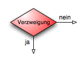

# Flussdiagramm

Unter Flussdiagramm versteht man eine Veranschaulichung von
Programmabläufen. Man unterscheidet in zwei verschiedene Arten, einmal
das *Datenflussdiagramm* und den *Programmablaufplan*.[^1]

## Datenflussdiagramm

Das Datenflussdiagramm stellt die Verwendung, die Bereitstellung und die
Veränderung von Daten innerhalb eines Programmes dar.

------------------------------------------------------------------------

**Elementtypen**

-   *Datenspeicher*: zwei parallele Linien zwischen den der Speichername
    steht
-   *Datenfluss*: normaler Pfeil mit Namen
-   *Funktion*: Kreis mit Namen
-   *Schnittstelle*: Rechteck mit Schnittstellenname

 [^2]

## Programmablaufplan

Der Programmablaufplan (PAP) stellt den Ablauf eines Programms grafisch
dar. Anders gesagt es versucht den Algorithmus nachvollziehbar
darzustellen. Alle Symbole sind in der DIN 66001 vereinheitlicht.

------------------------------------------------------------------------

**Elemente**

-   Kreis/ Oval als Start oder Stop

 [^3]

-   Linie oder Pfeil zur Verbindung der Elemente

 [^3]

-   Rechteck als Tätigkeit

 [^3]

-   Rechteck mit doppelten Linien

 [^3]

-   Raute mit einer Entscheidung

 [^3]

-   Paralelogramm für Ein- oder Ausgabe

 [^3]

## Quellen

[^1]: [Wikipedia](https://de.wikipedia.org/wiki/Flussdiagramm)
[^2]: Von Edited by User:AutumnSnow with GIMP, based on Image:DataFlowDiagram Esempio1.png created by User:Ilario - Eigenes Werk, CC BY-SA 3.0
[^3]: Von Daniel Göhler - Eigenes Werk, CC BY-SA 3.0
